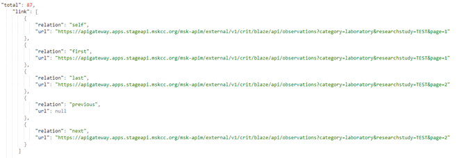

The FHIR Payload is returned as a FHIR Bundle, and is a collection of resources that can contain from zero resources to the actual count of the available resources based your query search. It is good practice not to return all data, by default we are capping the number of resources to fifty; however, this number is configurable via a parameter _count. We advise keeping this default value to prevent database timeouts.

Paging is presented via the link Bundle attribute. The link attribute identifies the Links related to this Bundle.

In the figure above there are total of 87 resources, and it set to only return 50 resources. In order to obtain the remaining 37 records, the `"relation" : "next"` json object must be used to read the value of the computed URL value.   

Note: The parameter `page` is used, and in this case it is stated as 2.  

You can use the “self”, “first”, “last” and “previous” to navigate back and forth to obtain previous resources.  
